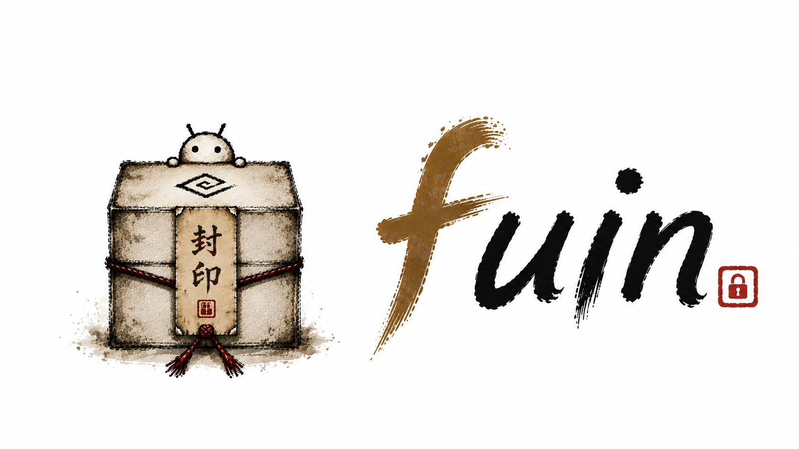

# fuin

  

**Android APK Packer — protect bytecode, block cheating, resist reverse engineering.**

fuin takes a finished APK and produces a new, protected one. DEX bytecode, native
libraries and assets are encrypted with AES-256-GCM; a small stub decrypts them in
memory at launch. Anti-tamper, root detection and emulator blocking raise the bar
against runtime instrumentation.

No source changes. No network at runtime. Works fully offline.

-   :material-rocket-launch: **[Quickstart](getting-started/quickstart.md)**

    Pack your first APK in about five minutes.

-   :material-download: **[Installation](getting-started/installation.md)**

    Docker, pip, or a local development setup.

-   :material-book-open-variant: **[User guide](guide/web-ui.md)**

    Web UI, CLI, REST API, Gradle plugin, GitHub Action.

-   :material-shield-check: **[Security](security/protection-layers.md)**

    What fuin protects against — and what it does not.

---

## Demo

---

## What you get

### Protection

| | |
|---|---|
| **Static analysis resistant** | The APK ships only ciphertext — no runnable bytecode for jadx or apktool to read |
| **Anti-tamper** | The signing certificate is verified at runtime; re-signed or patched APKs refuse to run |
| **Root detection** | Blocks execution on rooted devices, defeating Magisk-based cheat tooling |
| **Emulator detection** | Keeps the app off bot farms and automated exploit rigs |
| **Frida/Xposed resistant** | Root and emulator checks raise the cost of dynamic instrumentation |
| **Native lib encryption** | `.so` files from Unity, Unreal or custom C++ are encrypted against IDA/Ghidra |
| **Asset encryption** | Game configs, level data and databases are encrypted at rest |
| **String obfuscation** | DEX string constants are XOR-encrypted against `strings` dumps |
| **Unity & Flutter** | Works out of the box — no extra configuration |

### Developer experience

| | |
|---|---|
| **Fully offline** | The key ships inside the APK; nothing is fetched at launch |
| **Web UI + REST API** | Upload from a browser or `curl`, download immediately |
| **CLI** | One command: `fuin-pack pack in.apk out.apk` |
| **Docker-first** | No local Android SDK required |
| **Live progress** | Pack progress streamed over SSE |
| **Pack report** | A diff of size, encrypted targets and metadata |
| **Gradle plugin** | Auto-pack after `assembleRelease` |
| **GitHub Action** | Drop-in step for CI/CD |

---

## How it works

fuin is two halves: a **pack-time** pipeline that rewrites the APK, and a **runtime**
stub that undoes the encryption on device.

At pack time the original `classes.dex` is encrypted and replaced by a stub DEX; the
ciphertext, the key and a runtime policy are added as assets. At launch the stub
verifies the signing certificate, decrypts the DEX into `codeCacheDir`, loads it with
a `DexClassLoader`, and hot-swaps itself for the app's real `Application` class.

See **[Architecture](reference/architecture.md)** for the full pipeline diagrams.

!!! warning "Read the threat model before shipping"

    The AES key is bundled inside the APK by design. That defeats static analysis,
    not an attacker who controls the device. See
    **[Threat model](security/threat-model.md)** for the exact boundaries.

---

## Where to go next

- New to fuin → **[Quickstart](getting-started/quickstart.md)**
- Wiring it into a build → **[Gradle plugin](guide/gradle-plugin.md)** or **[GitHub Action](guide/github-actions.md)**
- Tuning what gets encrypted → **[Configuration](reference/configuration.md)**
- Deciding whether it fits your threat model → **[Threat model](security/threat-model.md)**

---

## License

[MIT](https://github.com/ykus4/fuin/blob/main/LICENSE) © 2026 yotti
